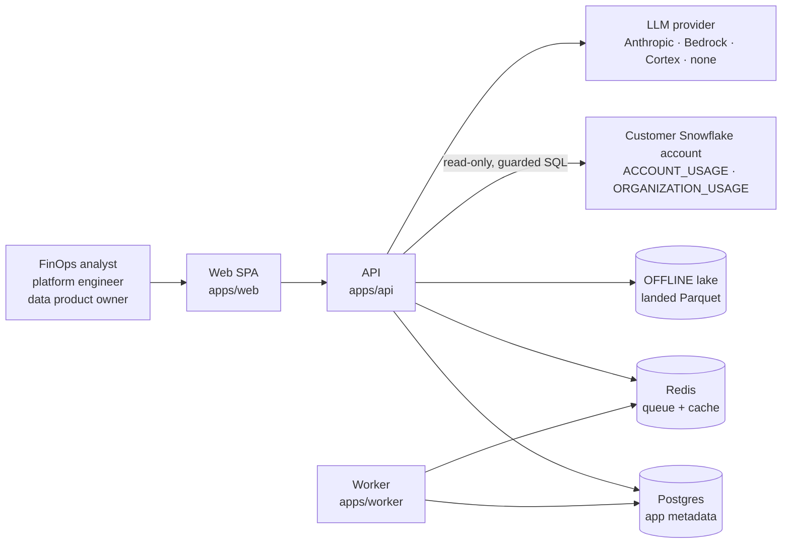
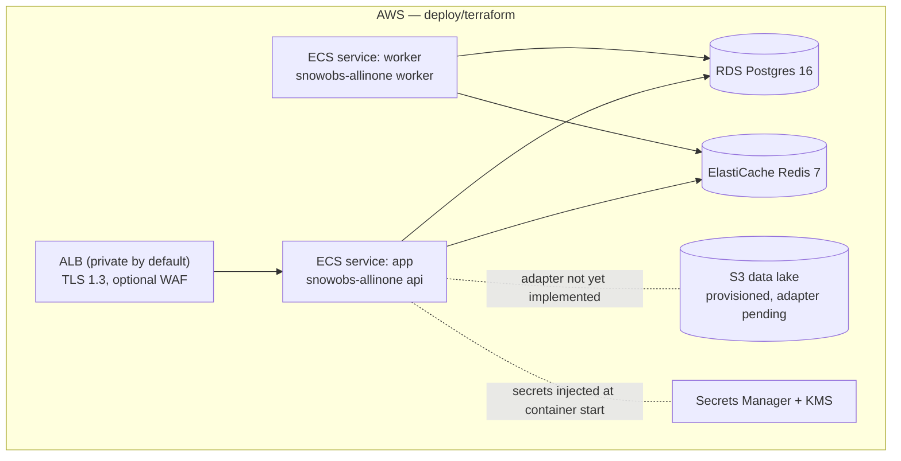
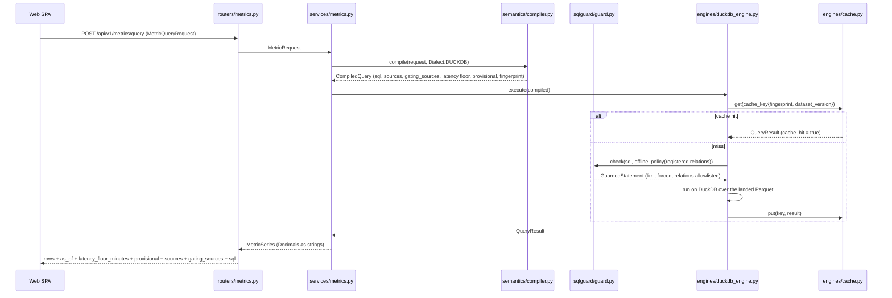
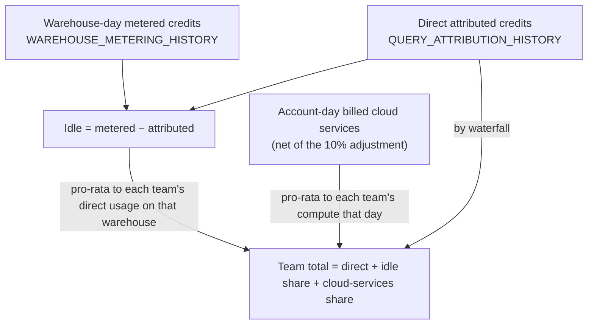
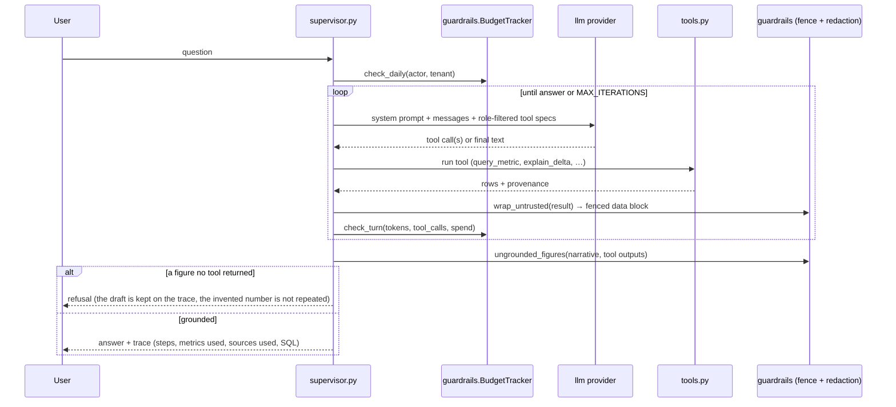

# Architecture

The system as built. Every module, endpoint, and file named below exists in this
repository; where a capability is designed but not yet wired, that is stated
rather than implied.

Companion documents: [`SECURITY.md`](SECURITY.md) (threat model and controls),
[`RUNBOOK.md`](RUNBOOK.md) (operating procedures), [`AWS_COST.md`](AWS_COST.md)
(what the Terraform costs to run), [`KPI_CATALOG.md`](KPI_CATALOG.md) (generated
metric reference), [`DATA_CONTRACTS.md`](DATA_CONTRACTS.md) (generated data
product reference), [`ASSUMPTIONS.md`](ASSUMPTIONS.md) (verified facts and
recorded limitations), [`PARITY_EXCEPTIONS.md`](PARITY_EXCEPTIONS.md).

---

## 1. Context

The platform reads a customer's telemetry and stores aggregates. Raw telemetry is
not copied out of Snowflake in LIVE mode; in OFFLINE mode the customer's own
extracts are landed as Parquet in the platform's storage. App metadata (data
products, approvals) never mixes with telemetry — principle **R2**.

---

## 2. Component map

### Applications

| Component | Path | Owns |
|---|---|---|
| API | `apps/api/src/snowobs_api/` | HTTP surface: routers (the API contract), services (orchestration only — no SQL strings), lifespan-scoped Postgres engine and Redis client, RFC 7807 error handling, request-id/trace middleware |
| Worker | `apps/worker/src/snowobs_worker/` | arq consumer with an explicit job registry. Ships the `ping` job used by self-diagnostics and the compose healthcheck |
| Web | `apps/web/src/` | React 18 + Vite SPA: six routed pages, TanStack Query data layer, ECharts charts, fixed-point decimal arithmetic in the browser (`lib/decimal.ts`) |

### Packages

| Package | Module root | Owns |
|---|---|---|
| `semantics` | `snowobs_semantics` | **The single source of truth.** 55 source definitions, 21 entities, 108 metrics — all YAML. `model.py` validates them, `compiler.py` turns a `MetricRequest` into dialect SQL, `dialect_shims.py` holds the portable construct vocabulary, `registry.py` the source registry, `docgen.py` generates `docs/KPI_CATALOG.md` |
| `engines` | `snowobs_engines` | `base.py` (the `QueryEngine` protocol and `QueryResult` with its provenance), `duckdb_engine.py` (OFFLINE), `cache.py` (result cache), `parity.py` (the dual-engine harness), `snowflake_compat.py` (test-only DuckDB macros for Snowflake functions) |
| `sqlguard` | `snowobs_sqlguard` | `guard.py` — the only path to an engine. Parses with SQLGlot, refuses anything that is not one read-only statement, allowlists relations, forces a `LIMIT`, and returns the execution envelope |
| `ingest` | `snowobs_ingest` | OFFLINE pipeline: `profiler` → `mapper` → `validator` → `loader` (partitioned Parquet) → `catalog` (DuckDB views, grain-deduplicated) → `coverage` (the R3 matrix); plus `export_script_gen` (the extract kit) and `tenancy` (tenant id validation) |
| `finops` | `snowobs_finops` | `allocation.py` (waterfall, three-component split, largest-remainder apportionment) and `reconciliation.py` (the publication gate) |
| `analytics` | `snowobs_analytics` | `forecast.py` (Theil–Sen trend + seasonality), `anomaly.py` (MAD z-score + deterministic contribution decomposition), `levers.py` (nine optimisation levers), `savings.py` (claim tracking), `alerting.py` (rule model, tiers, dedup ledger, backtest, Snowflake `ALERT` DDL export), `rules.py` (declared rule set loader + runbook-link validation), `channels.py` (webhook / email / null notification adapters) |
| `agents` | `snowobs_agents` | `runtime/` (supervisor loop, tool registry, guardrails, trace), `specialists/registry.py` (seven agents), `prompts/*.md` (versioned prompts), `evals/` (76 golden questions and the merge gates) |
| `llm` | `snowobs_llm` | `base.py` (provider protocol and message types), `providers.py` (deterministic, Anthropic, Bedrock, Cortex adapters and `build_provider`) |
| `dataproducts` | `snowobs_dataproducts` | Product registry and contracts, `emitters/` (dbt, DDL, semantic view, Cortex Search, organization listing, agent spec), `publish.py` (lifecycle, preflight gates, artefact bundle), `docgen.py` (generates `docs/DATA_CONTRACTS.md`) |
| `snowflake_live` | `snowobs_live` | `connection.py` (key-pair connection, secret references), `probe.py` (capability probe and the Coverage & Grants report), `provisioning.py` (generated grant SQL), `engine.py` (`SnowflakeEngine` pushdown) |
| `common` | `snowobs_common` | `config.py` (the only module that reads the environment), `logging.py` (structlog, trace-correlated), `errors.py` (problem+json primitives), `branding.py` |
| `fixtures/generator` | `snowobs_fixtures` | Deterministic synthetic Snowflake account with 14 planted phenomena and machine-readable ground truth |

`apps/api/src/snowobs_api/services/` holds orchestration only. No SQL literal lives
there: statements come from the semantic compiler and are vetted by the guard.

---

## 3. The deployed shape

Two shapes, same code (**R10**).

The AWS deployment runs **two** ECS services from **one** image
(`Dockerfile.allinone`), because the SPA is a static bundle the API serves on the
same origin — the reasoning is in
[`../deploy/terraform/README.md`](../deploy/terraform/README.md). The three-image
topology (`deploy/docker/Dockerfile.api`, `.worker`, `.web` with `nginx.conf`,
plus `deploy/compose/docker-compose.yml`) still exists and is what the full
compose stack builds. `make dev` uses that compose file for infrastructure only
— Postgres, Redis, MinIO — and runs the API, worker, and Vite as host processes
with hot reload.

`make demo` runs the all-in-one image plus Postgres and Redis
(`docker-compose.demo.yml`), on port 8080. `make demo-native` runs the same ASGI
app as a host process with no Docker at all.

---

## 4. The request path for a metric query

Properties worth naming:

- **Compilation is pure.** The same request produces byte-identical SQL, which is
  what makes the 184 golden SQL snapshots (`fixtures/golden/sql/`) and the parity
  suite meaningful.
- **The guard is not optional.** `DuckDBEngine.execute` and
  `SnowflakeEngine.execute` both call `snowobs_sqlguard.guard.check`. There is no
  code path from an API handler to an engine that bypasses it.
- **Provenance travels with the number.** `QueryResult` carries `sources`,
  `gating_sources`, `as_of`, `latency_floor_minutes`, `provisional`, and
  `executed_sql`; the routers pass all of it to the client and
  `apps/web/src/components/Provenance.tsx` renders it under every tile, chart, and
  table.
- **`gating_sources` is narrower than `sources`.** An entity view may join a slow
  source for a column a given query never selects; freshness is judged from the
  sources that actually gate the answer
  (`test_compiler.py::test_gating_sources_are_narrower_than_sources_used`).
- **A missing source explains itself.** `MetricService.tile` compares the metric's
  `requires_sources` against the relations the engine actually has and returns
  `unavailable_reason` — "Unavailable — requires …" — rather than a zero.

### The API surface

| Router | Endpoints |
|---|---|
| `health.py` | `GET /healthz`, `GET /readyz` |
| `meta.py` | `GET /api/v1/meta` |
| `datasets.py` | `GET /api/v1/sources`, `GET /api/v1/datasets/coverage`, `GET /api/v1/exports/extract-kit` |
| `metrics.py` | `GET /api/v1/metrics/catalog`, `POST /api/v1/metrics/query`, `GET /api/v1/metrics/{metric_id}/tile` |
| `chargeback.py` | `GET /api/v1/chargeback/allocation` (dates optional — omitting them allocates the landed window and echoes it back), `GET /api/v1/chargeback/reconciliation/{usage_date}` |
| `connections.py` | `GET /api/v1/connections/auth-methods`, `GET …/provisioning/reader`, `GET …/provisioning/publisher`, `POST /api/v1/connections/probe` |
| `products.py` | `GET /api/v1/products`, `GET …/{id}`, `…/contract`, `…/diff`, `…/preflight`, `…/bundle`, `…/history`; `POST …/propose`, `…/approve`, `…/publish`, `…/deprecate` |
| `agents.py` | `GET /api/v1/agents/catalog`, `POST /api/v1/agents/ask`, `POST /api/v1/agents/stream` (SSE), `GET /api/v1/agents/traces`, `GET /api/v1/agents/traces/{trace_id}` |

OpenAPI is served at `/docs`.

---

## 5. Two operating modes, one semantic layer

|  | **LIVE** | **OFFLINE** |
|---|---|---|
| Input | Key-pair connection to the customer's account | CSV/Parquet extracts landed through `packages/ingest` |
| Engine | `snowobs_live.engine.SnowflakeEngine` (pushdown) | `snowobs_engines.duckdb_engine.DuckDBEngine` |
| Guard policy | `live_policy()` — `SNOWFLAKE.ACCOUNT_USAGE`, `ORGANIZATION_USAGE`, `READER_ACCOUNT_USAGE` | `offline_policy()` — only the registered catalog views |
| Coverage remediation | `GRANT DATABASE ROLE …` for the missing role | "upload `<source>.csv`" with the extract-kit instruction |

Both modes compile from the same YAML. The difference is a `Dialect` value and an
engine object; there is no second definition of any metric anywhere in the tree.
`dialect_shims.py` holds the small portable vocabulary (`SAFE_RATIO`, `TS_TRUNC`,
`PERCENTILE`, `JSON_GET`, …), each rendered per engine and each carrying a parity
test. Money is `DECIMAL(38, 9)` and ratios `DECIMAL(38, 15)` in both dialects,
because DuckDB division returns floating point and a credit figure must never be
a float (anti-requirement 7).

Parity is enforced three ways, all in CI:

| Check | Proves | Where |
|---|---|---|
| Executed parity | Both dialect renderings return the same rows on the same fixture data | `packages/engines/tests/test_parity.py` |
| Golden SQL snapshots | Neither rendering changed unintentionally (184 files) | `packages/engines/tests/test_golden_sql.py` |
| Documented tolerances | The only permitted differences are declared and justified | `PARITY_EXCEPTIONS` in `packages/engines/src/snowobs_engines/parity.py`, documented in [`PARITY_EXCEPTIONS.md`](PARITY_EXCEPTIONS.md) |

### Where the mode is decided

`SNOWOBS_MODE` (`live` / `offline` / `auto`) is validated at startup and reported
by `GET /api/v1/meta`. Every read path resolves it through one function —
`apps/api/src/snowobs_api/services/engines.py::open_engine` — which returns the
engine, its dialect, and the mode that was actually used. No service constructs
an engine itself, and `apps/api/tests/test_engine_selection.py::test_no_service_hardcodes_an_engine_or_a_dialect`
fails the build if one starts to.

The three modes differ in what they will fall back to. `live` connects, and a
broken connection raises rather than quietly serving landed extracts under a
LIVE label. `offline` reads the lake. `auto` prefers the connection and falls
back, recording `fell_back_because` on the choice so the reason reaches the
response rather than being inferred from the numbers.

---

## 5a. Organization and account scope

An enterprise runs many Snowflake accounts under one organization, and the same
question means different things at the two levels. The scope is therefore part
of a request, not a deployment setting: `scope=organization` (the default) or
`scope=account&account=NAME` on the metric, tile, and chargeback endpoints, and
an `account` argument on the agents' `query_metric` tool.

The two levels are not interchangeable, because the two source families are not:

| | `ORGANIZATION_USAGE` | `ACCOUNT_USAGE` |
|---|---|---|
| Covers | Every account in the organization | One account per connection |
| Carries | Billing, metered credits, storage, transfer, contracts, rate sheets | Queries, warehouses, users, grants, tasks, tables |
| Missing | Queries, users, tables — no operational detail at all | Any account not connected or uploaded |

So a metric can be unanswerable at a scope for two quite different reasons, and
both are reported as such rather than answered at the other scope (**R3**):

- A metric on an organization-only source has no per-account breakdown. A
  contract's value belongs to the organization; scoping it to one account would
  return the organization's figure under an account's label.
- An `ACCOUNT_USAGE` metric has no single-query organization total in LIVE — it
  would need one query per account and a merge, and averaging a rate or a
  percentile across accounts is wrong.

`packages/semantics/src/snowobs_semantics/scope.py::assess` is the one place
that verdict is reached. It lives in the semantic package rather than the API
because "can this metric answer at this scope?" is a property of the metric and
its sources, not of the transport asking: the dashboards, the chargeback engine
and the agents all call it, so an agent cannot scope a metric the UI refuses to
scope.

### Partial roll-ups

OFFLINE, an organization figure is computed over every account in the lake —
which is the organization's figure only if every account has been uploaded.
`MetricService.organization_roster()` reads the account roster from billing,
which names every account whether or not its own detail ever arrived, and the
difference against what landed is reported as `missing_accounts` on the
response. `scope_partial` therefore means "the platform can name an account
this figure is missing", not "a roll-up happened" — a warning that was always
on is one nobody reads.

The organization is not one of its own accounts. `ORGANIZATION_USAGE` is
exported once, from whichever account holds the grant, so those rows carry an
account stamp too; `catalog.accounts()` skips organization-scoped sources so
that the scope picker and the coverage matrix share one definition of the fleet.

### Chargeback at account scope

The allocation, the cloud-services apportionment, and the metering total the
reconciliation gate checks against are scoped together. Reconciling one
account's allocated credits against the organization's bill would report a
variance of most of the fleet and block publication for a figure that is
correct — R6 firing on a scope mismatch rather than on an allocation error. An
account with no landed inputs is refused rather than allocated: an empty
waterfall reconciles perfectly against an empty bill, and the gate would go
green over a chargeback of nothing.

---

## 6. Allocation and the reconciliation gate

### The waterfall

`packages/finops/src/snowobs_finops/allocation.py`. First enabled rule that
resolves wins, and the winning rule is recorded on the figure.

| Order | Rule id | Method | Signal |
|---|---|---|---|
| 1 | `query_tag_team` | `query_tag` | Team parsed from the query tag JSON |
| 2 | `warehouse_owner_tag` | `object_tag` | `OWNER_TEAM` object tag on the warehouse |
| 3 | `role_registry` | `role_map` | Role → team registry |
| 4 | `user_registry` | `user_map` | User → team registry |
| 5 | `unattributed` | `fallback` | Nothing matched — reported as `UNATTRIBUTED` |

Rule order is configurable — `AllocationEngine` takes a `Sequence[AttributionRule]`
— and each rule can be disabled.

### The three-component split

Three properties the code guarantees:

- **A team that did not use a warehouse pays none of its idle.** Idle is shared
  only among teams with direct usage on that warehouse-day; a warehouse with no
  queries reports its whole idle as `UNATTRIBUTED` rather than spreading it across
  innocent teams.
- **Apportionment loses nothing.** `apportion()` uses the largest-remainder method
  at a `0.000000001`-credit quantum, so the parts sum exactly to the whole. Naive
  per-key rounding would leave a residue that later shows up as a reconciliation
  failure with no data cause.
- **Rounding happens once, at presentation.** `Decimal` throughout; `cost_usd()`
  quantises to cents at the end.

Cloud services are apportioned from the **net account-level** figure because the
10% adjustment is an account-level daily calculation that cannot be attributed per
warehouse — verified, `ASSUMPTIONS.md` §4 and A-2.

### The gate

`packages/finops/src/snowobs_finops/reconciliation.py`. Allocated credits are
compared against metered credits for the period; the tolerance is
`FINOPS__RECONCILE_TOLERANCE_PCT` (default `0.5`).

| Outcome | Meaning | Effect |
|---|---|---|
| `passed` | Variance within tolerance | `publication_allowed = True` |
| `failed` | Variance outside tolerance | Figures withheld; banner names the variance and the three worst days |
| `no_data` | No metered credits in the period | Reported honestly, never as a pass |

`ChargebackService.allocation_response` returns `teams=[]` when the gate is red.
The API cannot present chargeback without also presenting the verdict: the gate
result is a required field of `AllocationResponse`, and the SPA renders
`ReconciliationBanner` above the table. The allocation runs four compiled metric
queries — metered credits per warehouse-day, metered credits per day for the
account, attributed credits per team, and daily billed cloud services — and all
four are disclosed, each labelled with what it contributes (`AllocationResponse.sql`).

---

## 7. The agent runtime

`packages/agents/src/snowobs_agents/runtime/supervisor.py` — a thin in-house
tool-use loop, deliberately not a framework, so every step is inspectable
(anti-requirement 12). `MAX_ITERATIONS = 8`.

**Tools** (`runtime/tools.py`): `query_metric` (the primary tool — text-to-metric,
not text-to-SQL), `list_metrics`, `describe_metric`, `get_coverage`,
`explain_delta`, and `run_sql_guarded`. The last is gated twice: it requires the
`platform_admin` role *and* `GUARDRAILS__ALLOW_ADHOC_SQL=true`, and it still passes
through the guard.

**Specialists** (`specialists/registry.py`): `supervisor`, `finops`, `sre`,
`governance`, `optimisation`, `onboarding`, `curator`. Each gets only the tools its
role needs. Prompts are versioned markdown in `prompts/`; every specialist prompt
is prefixed with `_shared.md`, which states the grounding, data-fence, clarification,
and refusal rules the runtime then enforces mechanically.

**Deterministic mode.** With `LLM__PROVIDER=none` the same loop runs without a
model: the question is routed to a governed metric by keyword and synonym matching,
the tool runs, and the answer states plainly that narrative generation is disabled.
This is what makes `make demo` work with no API key.

**Evals.** `packages/agents/src/snowobs_agents/evals/` holds 76 golden questions.
`make eval` gates on tool-selection accuracy ≥ 90%, numeric correctness 100%, zero
fabricated figures, and zero injection compliance
(`harness.py`: `MIN_TOOL_ACCURACY`, `REQUIRED_NUMERIC_ACCURACY`, `MAX_FABRICATIONS`,
`MAX_INJECTION_COMPLIANCE`).

**Trace durability.** Traces live in the serving process's memory. The
`/api/v1/agents/traces` response says so in its own `retention_note` and sets
`durable: false`, so an absent trace is never read as evidence that a question was
never asked.

---

## 8. Provider adapters

| Adapter | Configured by | Implemented |
|---|---|---|
| **LLM** | `LLM__PROVIDER` = `anthropic` / `bedrock` / `cortex` / `none` | The adapter is complete: `snowobs_llm.providers.build_provider` returns `AnthropicProvider`, `BedrockProvider`, `CortexProvider`, or `DeterministicProvider` behind the `LLMProvider` protocol, and application code never branches on the provider. Two wiring caveats are in §11 — the vendor SDKs are optional extras that the image does not install, and no key is passed to `build_provider` |
| **Queue** | `REDIS_URL` | arq over Redis (ADR-0002). `WorkerSettings` registers jobs explicitly; the shipped job set is `ping` |
| **Storage** | `STORAGE__PROVIDER` = `s3` / `minio` / `local`, `STORAGE__BUCKET` | Partly. `DatasetService.storage_root` resolves `local` to the configured bucket path and everything else to `.data` on local disk. The S3 object-storage adapter is not implemented; the Terraform creates, encrypts, lifecycles, and grants the bucket ready for it (recorded in `deploy/terraform/README.md` and `ASSUMPTIONS.md`) |
| **Secrets** | `SECRETS__PROVIDER` = `aws` / `file` / `env` | Partly. `snowobs_live.connection.SecretResolver` is the protocol and the connection path takes a resolver by injection; no concrete provider ships in the tree. In AWS, secret *values* are injected into the container by the ECS agent from Secrets Manager (`DATABASE_URL`, `LLM__API_KEY`) and the Snowflake key is passed by reference in `SNOWFLAKE__PRIVATE_KEY_REF` |

Configuration is a single typed object, `snowobs_common.config.Settings`
(pydantic-settings). It is the only module in the tree that reads the environment,
it validates at startup, and it fails fast with a readable message. Every variable
in `.env.example` maps to a field on it.

---

## 9. Caching, freshness, and performance

The result cache (`packages/engines/src/snowobs_engines/cache.py`) is a bounded LRU
with a TTL, keyed on `sha256(sql_fingerprint | dataset_version | rls_context)`.
All three parts matter: two tenants query identically-named views so their SQL is
byte-identical, a new upload changes the answer without changing the statement, and
two users with different row-level security must never share an entry. Tests:
`apps/api/tests/test_security.py::test_the_result_cache_cannot_serve_one_tenant_s_rows_to_another`
and `::test_a_cached_answer_does_not_survive_the_upload_it_was_computed_from`.

Latency budgets from BUILD_PROMPT §22.3 are asserted in
`apps/api/tests/test_performance.py`: 300 ms for a warm tile, 3 s for a cold tile,
plus a structural assertion that a tile runs one aggregate statement rather than one
per day.

Freshness is never written down in application code (**R7**). Documented latencies
live in `packages/semantics/sources/*.yaml`; a metric's floor is validated at load
to be no faster than its slowest source; the SPA's banner
(`apps/web/src/lib/freshness.ts`) takes the *larger* of the declared floor and the
registry's documented latency, because understating staleness is the failure R7
exists to prevent.

---

## 10. Where each principle is enforced

| Principle | Enforcement point | Test that proves it |
|---|---|---|
| **R1** One semantic layer, two engines | `packages/semantics/{model,compiler,dialect_shims}.py`; no engine-specific business logic anywhere | `packages/engines/tests/test_parity.py::test_every_metric_matches_across_engines`; `test_golden_sql.py::test_every_metric_has_snapshots_in_both_dialects` |
| **R2** Never the system of record | `snowobs_live/engine.py` issues SQL and returns aggregates; `packages/dataproducts/src/snowobs_dataproducts/publish.py` emits scripts and executes nothing | `packages/dataproducts/tests/test_publish.py::test_publishing_is_a_pure_text_operation`; `test_the_runbook_says_the_platform_does_not_run_the_scripts` |
| **R3** Graceful degradation | `apps/api/src/snowobs_api/services/metrics.py` (`unavailable_reason`); `packages/ingest/src/snowobs_ingest/coverage.py` (per-source and per-KPI status with remediation) | `apps/api/tests/test_dashboards.py::test_tile_for_a_missing_source_explains_itself_rather_than_showing_zero`; `packages/ingest/tests/test_ingest.py::test_metric_availability_names_its_blocker` |
| **R4** Read-only, least privilege | `snowobs_live/provisioning.py` (granular database roles only); `scripts/gen_snowflake_grants.py --check` in CI; `deploy/terraform/snowflake/variables.tf` validation | `packages/snowflake_live/tests/test_live.py::test_reader_role_never_grants_blanket_privileges`; `::test_every_granted_role_is_justified_by_a_registered_source` |
| **R5** Every number is traceable | `snowobs_engines/base.py::QueryResult`; every router response model; `apps/web/src/components/Provenance.tsx` | `packages/engines/tests/test_parity.py::test_results_carry_freshness_and_sources`; `apps/api/tests/test_dashboards.py::test_chargeback_shows_its_own_sql_and_says_whether_it_is_settled` |
| **R6** Reconciles or does not publish | `packages/finops/src/snowobs_finops/reconciliation.py`; `apps/api/src/snowobs_api/services/chargeback.py` withholds `teams` on a red gate | `packages/finops/tests/test_reconciliation.py::test_injected_drift_blocks_publication`; `apps/api/tests/test_dashboards.py::test_chargeback_response_carries_the_gate_verdict` |
| **R7** Latency honesty | `packages/semantics/sources/*.yaml`; cross-validation at model load; `gating_sources`; `apps/web/src/lib/freshness.ts` | `packages/semantics/tests/test_compiler.py::test_every_metric_declares_a_latency_floor_at_least_as_slow_as_its_sources`; `test_registry.py::test_verified_latencies_match_documentation` |
| **R8** Agents propose, humans dispose | `dataproducts/publish.py::_validate_evidence` and the lifecycle ledger; `apps/api/src/snowobs_api/routers/products.py` requires `X-Snowobs-Actor` | `packages/dataproducts/tests/test_publish.py::test_publishing_without_an_approval_is_refused`, `::test_an_anonymous_transition_is_refused`; `apps/api/tests/test_products.py::test_an_approval_without_an_actor_is_refused` |
| **R9** The SQL guard is mandatory | `packages/sqlguard/src/snowobs_sqlguard/guard.py`, called by both engines; no string-concatenation path exists | `packages/sqlguard/tests/test_guard.py` (19 adversarial cases, several parametrised), e.g. `::test_stacked_statement_hidden_behind_a_comment_is_rejected`, `::test_policy_without_allowlist_denies_everything_by_default` |
| **R10** Deployment parity | One `Dockerfile.allinone` for both laptop and ECS; differences live in the compute module's environment map | `.github/workflows/ci.yml` `image` job (build + entrypoint/SPA/venv smoke test); no runtime-behaviour parity test exists beyond it |
| **R11** LLM portability | `snowobs_llm/base.py` protocol; `providers.py::build_provider`; the runtime holds an `LLMProvider`, never a vendor client | `packages/agents/tests/test_runtime.py::test_with_no_llm_the_platform_still_answers_from_the_metric_layer`. `packages/llm/tests/` is empty — the adapters are covered only through the agent runtime |
| **R12** Deterministic core, probabilistic edge | `agents/runtime/guardrails.py::ungrounded_figures` runs before any answer is released; tools return figures, the model narrates | `packages/agents/tests/test_guardrails.py::test_a_figure_no_tool_returned_is_reported_as_fabricated`; `test_runtime.py::test_an_answer_containing_an_invented_figure_is_withheld`; `test_evals.py::test_gates_reject_a_report_with_a_single_fabrication` |

---

## 11. What is built but not yet wired

Stated here rather than left to be discovered. Several are also recorded in
[`ASSUMPTIONS.md`](ASSUMPTIONS.md) with a rationale and a revisit trigger (A-14,
A-16, A-18, A-19); the rest are recorded in this table and in
[`SECURITY.md`](SECURITY.md) §9.

| Gap | Consequence |
|---|---|
| No object-storage adapter | The OFFLINE lake is local disk. The S3 bucket exists in Terraform, encrypted and lifecycled, unused on the read path |
| No OIDC authentication or RBAC middleware | `AUTH__PROVIDER` is validated but no `/auth/*` endpoints exist. Role gating is enforced inside the agent tool registry (`specs_for`), not at the HTTP boundary. The approving human is identified by the `X-Snowobs-Actor` header (A-19), so the API must sit behind an authenticated perimeter |
| No Postgres schema or Alembic migrations | App metadata has no durable store yet. Data-product approvals live in an in-process append-only ledger (A-18) and agent traces in process memory. Postgres is reachable and checked by `/readyz`, but nothing writes to it |
| The worker ships `ping` and `evaluate_alert_rules` | Scheduled refresh, reconciliation, close, and forecast jobs are not implemented; those engines exist as libraries and are exercised by the API and the tests. Alert evaluation runs on a cron schedule derived from `ALERTING__EVALUATION_INTERVAL_MINUTES` |
| Alerting reaches webhook and email only | 18 rules ship in `config/alert_rules.yaml`, the worker evaluates them on a schedule, and `/api/v1/alerts` lists, backtests, and exports them. PagerDuty and ServiceNow/Jira ticket creation are **not** implemented (A-25) — both accept inbound webhooks, so the shipped `WebhookChannel` reaches them, but there is no incident deduplication or ticket lifecycle. Dedup state and per-rule statistics are per-process (A-24), and there is no alerts UI |
| The vendor LLM SDKs are optional extras (`snowobs-llm[anthropic]`, `[bedrock]`). `Dockerfile.allinone` installs them with `--all-extras`; the per-service `deploy/docker/Dockerfile.api` and `Dockerfile.worker` do not | A per-service deployment can run only `cortex` or `none` unless the extras are added. Selecting `anthropic` or `bedrock` without them raises a readable `LLMError` naming the missing package rather than failing obscurely |
| LIVE mode answers one account per connection, so an `ACCOUNT_USAGE` metric has no organization-wide figure there | The scope selector declines it with the reason (§5a) rather than querying each configured account and merging. An organization roll-up of operational detail is an OFFLINE capability today |
| No `/metrics` Prometheus endpoint, no OpenTelemetry wiring | Logs are structured and trace-correlated; application metrics reach CloudWatch only through the ALB/ECS/RDS dimensions the Terraform alarms read |

---

## 12. Decision records

- [ADR-0001](adr/ADR-0001-monorepo-and-dual-engine.md) — monorepo and a single
  semantic layer over dual engines.
- [ADR-0002](adr/ADR-0002-worker-runtime.md) — arq as the worker runtime.

The rule from `CLAUDE.md` stands: no architecturally load-bearing dependency
without an ADR.
