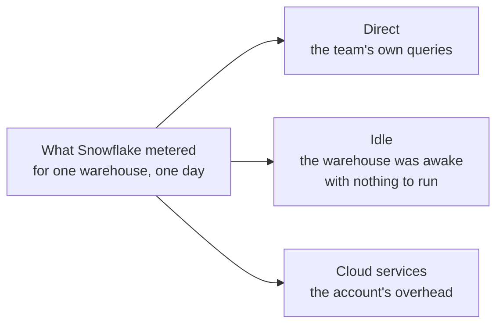

# User guide

For the FinOps analyst who will use this daily. No engineering background is
assumed. Where a term is Snowflake's rather than ours, it is in the
[glossary](#glossary).

The product's own reference material lives elsewhere and is generated from the
code, so it never drifts: [`KPI_CATALOG.md`](KPI_CATALOG.md) defines all 108 KPIs,
and [`DATA_CONTRACTS.md`](DATA_CONTRACTS.md) describes the published data products.

---

## 1. The five things worth knowing on day one

1. **No figure appears without its provenance.** Under every tile, chart, and
   table there is a strip reading *as of …* and *latency floor …*, and a **Show the
   SQL** disclosure. Open it. The statement you see is the statement that produced
   the number.
2. **A number the platform cannot compute says so.** It never renders as zero. You
   will see *"Unavailable — requires `<view>`"* with what would fix it.
3. **Chargeback publishes only when it reconciles.** If allocated cost does not
   match the metered bill within 0.5%, the team table is empty and the banner says
   why. That is deliberate.
4. **Freshness is stated, never implied.** Every page tells you how stale its
   slowest input may be. Snowflake's usage views lag by design — between 45 minutes
   and 3 days depending on the view.
5. **The agent quotes; it does not calculate.** Every number in an agent answer
   came from the same governed metric a dashboard would use, and the answer shows
   you the SQL. If it cannot ground a figure, it declines rather than guessing.
6. **Every figure names its scope.** If your enterprise runs several Snowflake
   accounts, each number is either one account's or the whole organization's,
   and the page tells you which. See §2a.

---

## 2. Getting around

Six pages, one global time-range picker in the header. The range applies to every
page and is written into the URL, so any view you are looking at can be pasted
into a message and will open the same way for a colleague.

| Page | Question it answers |
|---|---|
| **Executive** (`/`) | What are we spending, on what, and how much of it is unowned? |
| **Platform health** (`/health`) | Is the platform behaving — failures, queueing, freshness? |
| **Chargeback** (`/chargeback`) | What does each team owe, and does it reconcile? |
| **Coverage & sources** (`/coverage`) | What can this platform answer today, and what is missing? |
| **Ask** (`/ask`) | Anything the metric catalogue can answer, in words |
| **System status** (`/status`) | Is the application itself up? |

Presets: last 7 days, last 30 days (the default), last 90 days, month to date, last
13 months, or a custom range.

---

## 2a. Organization or one account

Beside the time-range picker is a **scope** selector. It has one entry for the
whole organization and one for each Snowflake account the platform has data
for. Like the time range, the choice applies to every page.

The two levels answer genuinely different questions, and the selector is honest
about which questions each can answer:

- **Organization** — every account together. Billing, credits, storage, and
  contracts come from `ORGANIZATION_USAGE`, which covers every account whether
  or not that account has been onboarded. Operational detail — queries, users,
  warehouses, grants — is rolled up over the accounts that *have* been onboarded.
- **An account** — that account alone. This is where query-level detail lives:
  slow queries, spilling warehouses, grant drift, failing tasks.

Next to each entry is a count: *how many of the catalogue's KPIs can be answered
at this scope*. An account that has only had its billing uploaded will visibly
narrow the catalogue rather than filling the page with blanks.

**When a KPI cannot answer at the scope you chose, it says why.** Two reasons
come up:

- *"… describes the whole organization"* — a contract or a commitment balance
  has no per-account value. There is nothing to filter; switch to organization
  scope to read it.
- *"… cannot be narrowed to one account"* — the source does not record which
  account its rows came from. This is a coverage gap, and the coverage page
  names the extract that would fix it.

### "Missing from this roll-up"

An organization figure computed over uploaded detail is the whole
organization's only if every account has been uploaded. The platform knows the
full account list from billing, so when an account is in the bill but has landed
no detail, an organization-wide figure carries a note naming that account.

Take it seriously: it means the number in front of you is an **under-count**, by
whatever that account consumes. It is not a warning that appears on every
roll-up — if you never see it, every account the organization has is included.

### Chargeback and scope

Chargeback follows the selector like everything else. At account scope the
waterfall allocates within that account and the reconciliation gate checks it
against *that account's* metered bill — not the organization's, which would
report a variance of most of the fleet and block a correct figure.

An account with no chargeback inputs is refused, with the accounts that do have
data named. It is not allocated as zero: an empty allocation reconciles
perfectly against an empty bill, and a green gate over a chargeback of nothing
is worse than an error message.

---

## 3. Executive

### The six tiles

| Tile | What it counts | What a move means | What to do |
|---|---|---|---|
| **Total credits** | Every credit Snowflake metered — compute, cloud services (before the daily 10% adjustment), and serverless | The headline. Up without a matching rise in query volume means each unit of work got more expensive | Compare against **Query volume** on Platform health and **Cost per query** below |
| **Billed credits** | What is actually billed: compute plus cloud services *net* of the 10% adjustment | This is the number finance recognises, and the one chargeback reconciles against | Use this, not Total credits, when reconciling to an invoice |
| **Spend** | The same usage in contract currency | Restates until month close — it will usually carry a **Provisional** badge | Never quote a provisional spend figure as final. Wait for the close, or quote credits |
| **Unattributed spend** | The share of attributed credits carrying no team tag | Rising means tagging discipline is slipping, usually because a new workload arrived untagged | The target is **below 5%**. Find the warehouses contributing most, and get the query tag set at the source |
| **Idle credit share** | Metered credits with no attributable query, as a share of compute | The cost of warehouses being awake with nothing to do. Rising means auto-suspend is too long, or the workload got lumpier | Look at Platform health → warehouse utilisation, then shorten auto-suspend or consolidate schedules |
| **Cost per query** | Attributed compute credits ÷ number of queries | The clearest unit-cost signal. Rising while volume is flat is a regression, not growth | Check the offender fingerprints below and the pruning story behind them |

Definitions, sources, and freshness floors for all of these are in
[`KPI_CATALOG.md`](KPI_CATALOG.md).

### The charts

- **13-month trend** — total and billed credits by month. The gap between the two
  lines is the cloud-services adjustment.
- **Cost by service type** — where the money goes: warehouse compute, serverless
  tasks, AI services. A new slice appearing is a new class of spend to own.
- **Cost by warehouse** — the top warehouses by credits. Cost alone does not tell
  you whether a warehouse is *wrong*; pair it with utilisation and queueing on
  Platform health.
- **Top offender fingerprints** — the query shapes costing the most in aggregate.
  A fingerprint is the query with its literal values removed, so one expensive
  pattern run 10,000 times shows up as one line rather than 10,000.

---

## 4. Platform health

| Tile | What it counts | What to do when it moves |
|---|---|---|
| **Query failure rate** | Share of queries that did not complete successfully | A step change usually means one workload broke, not that the platform did. Ask the agent which warehouse or user the failures concentrate in |
| **Query volume** | Number of queries executed | Neutral on its own — it is the denominator for cost per query and the context for every cost move |
| **Queue overload share** | Share of elapsed query time spent waiting because the warehouse was already saturated | This is the *under*-provisioning signal. Sustained above a few percent on a warehouse that matters means users are waiting |

**Source freshness** lists every source the platform reads, with how fresh it
actually is against how fresh it is documented to be. This is the page to check
before you tell anyone a number is current.

**Queue overload by warehouse** and **Warehouse utilisation** are the pair that
tell you what to do about a warehouse:

| Utilisation | Queueing | Reading | Action |
|---|---|---|---|
| Low | None | Over-provisioned | Size down; check auto-suspend |
| Low | Some | Lumpy arrival, not size | Consolidate schedules before resizing |
| High | None | Well matched | Leave it alone |
| High | Sustained | Under-provisioned | Size up, or add a cluster |
| Near zero, credits still burning | None | A "zombie" — awake, unused | Find out what wakes it, then suspend or drop it |

---

## 5. Chargeback

### Read the banner first

The reconciliation banner sits above every figure on the page, and there are only
three things it can say:

| Banner | Meaning | What you may do with the numbers |
|---|---|---|
| **Reconciled: allocated X vs metered Y (±Z%), within ±0.5%** | The parts add up to the bill | Publish them |
| **Chargeback blocked: … outside ±0.5%. Largest daily variances: …** | They do not add up | Nothing. The team table is empty by design |
| **Reconciliation could not run: no metered credits for …** | There is nothing to reconcile | Check the coverage page — an input has not landed. If nothing at all has landed, the page reports that instead of showing an account that appears to have cost nothing |

A blocked gate is not a bug to work around. It is the platform refusing to hand you
a number you would have to defend later. Take the named days to whoever owns the
data load; the [runbook](RUNBOOK.md#the-reconciliation-gate-is-red) has the
diagnosis steps.

### How allocation works, in plain language

Snowflake bills you per warehouse, per hour. It does not bill you per team. Getting
from one to the other is the whole job, and it happens in two steps.

**Step one — whose query was it?** For each query the platform asks five questions
in order and stops at the first one it can answer:

1. Does the query carry a team in its **query tag**?
2. Does the **warehouse** carry an `OWNER_TEAM` tag?
3. Is the query's **role** mapped to a team?
4. Is the query's **user** mapped to a team?
5. None of the above → **UNATTRIBUTED**.

Earlier rules are better because they are closer to the work. A query tag is set by
the job that ran; a user mapping is an inference about a person.

**Step two — the three components.** A team's cost is not just its own queries.
Every warehouse-day splits three ways:

| Component | Plain meaning | How it is shared out |
|---|---|---|
| **Direct** | The credits the team's own queries actually consumed | Not shared — it is measured per query |
| **Idle** | Credits metered while the warehouse was running but no query was attributable to them | Split across the teams that *used that warehouse that day*, in proportion to their direct usage. **If you did not use it, you pay none of its idle** |
| **Cloud services** | Snowflake's own overhead for the account — compilation, metadata, result cache — after the daily 10% allowance | Split across all teams in proportion to their compute that day |

Two consequences worth being ready to explain:

- **A warehouse nobody used still costs money.** Its idle is reported as
  `UNATTRIBUTED` rather than spread across teams that had nothing to do with it.
  That line is the honest answer, and it is usually the start of a good
  conversation about who owns the warehouse.
- **The parts always sum to the whole.** The split uses a method that assigns every
  last thousandth of a credit rather than rounding each share independently. If the
  components did not sum exactly, the gate would fail for an arithmetic reason and
  you would spend a day looking for a data problem that was not there.

### Why unattributed spend exists

It is not a defect; it is a measurement of tagging discipline. Cost lands in
`UNATTRIBUTED` when:

- a query ran without a team in its tag, and its role and user are not mapped;
- a warehouse ran with no queries at all, so its idle belongs to nobody;
- a workload is new and nobody has claimed it yet.

Treat the figure as a KPI in its own right (`cost.unattributed_share`, target below
5%) and drive it down at the source — set the query tag in the job, or tag the
warehouse with an owning team. Do **not** ask for it to be spread across teams: the
moment unowned cost is silently shared out, nobody has a reason to fix it.

### The rest of the page

- **Allocated cost by team** — direct, idle, cloud services, total, share, and
  currency where a credit price is configured. If no rate is set the currency
  column is blank rather than invented.
- **Unattributed share** — the same number as the Executive tile, in context.
- **Component mix** — the three components per team. A team that is mostly *idle*
  has a warehouse problem, not a query problem.
- **Show the SQL** — the allocation is four statements, and all four are shown,
  each labelled with what it contributes.

**Showback or chargeback?** The page header says which mode the deployment is in.
Showback means the numbers are published for visibility; chargeback means they
cross-charge. The recommended path is to run showback until the gate has been green
across a few closes.

---

## 6. Coverage & sources

This is the page that tells you what to trust.

For every source: its status, how many rows landed, the window they cover, how
fresh it is against its documented latency, and — when something is wrong — the
remediation, ready to copy.

| Status | Meaning | What to do |
|---|---|---|
| **Available** | Present and inside its documented latency | Nothing |
| **Stale** | It landed, but its newest row is older than its documented latency allows | The export schedule has probably stopped. The remediation names the file to re-upload. It is *not* missing — do not send anyone hunting for a load that never happened |
| **Empty** | Matched and landed, but no usable rows | The extract's window or `WHERE` clause is wrong. Re-export wider |
| **Missing** | Never uploaded, or no grant | In OFFLINE mode: upload the named file. In LIVE mode: the remediation is the exact `GRANT DATABASE ROLE …` statement to send to your Snowflake administrator |

Below the sources, **KPIs affected** lists every metric a missing or partial source
degrades or blocks, and names the blocker. That list is the honest answer to "can
this tool tell me X yet?".

Two habits worth forming: check this page before quoting a figure you have not
quoted before, and send the remediation text verbatim — it is generated, so it is
correct, and it saves a round trip.

---

## 7. Freshness and provisional figures

Two different warnings that mean two different things.

**Freshness floor** — *"data no fresher than 3h (WAREHOUSE_METERING_HISTORY)"*.
Snowflake's usage views are not live: each has a documented maximum lag, from about
45 minutes for query history to 3 days for currency spend. The banner shows the
**slowest** source contributing to what you are looking at, and names it. A page
whose floor is 8 hours cannot tell you what happened an hour ago, and it says so
rather than showing you a confident, wrong number.

**Provisional** (an amber `◐ Provisional` badge) — the figure sits inside a window
in which its source may still *restate*. Billing views change intramonth for
adjustments, contract amendments, and account transfers, so a currency figure is
not final until month close. Hovering the badge says the same thing.

The practical rules:

- Quoting a provisional figure externally: don't. Quote credits, or wait for the
  close.
- Reconciling to an invoice: use **Billed credits**, and expect the last few days
  of any period to move.
- "Why doesn't this match the Snowflake UI?" — check the as-of stamp first. Nine
  times in ten you are comparing two different moments.

---

## 8. Ask — the agent console

Ask in plain language. The console shows its work as it goes: which tools it
called, which metrics they used, then the answer, then the SQL behind each figure.

**Question shapes that work well**

| Shape | Example |
|---|---|
| A figure | "What were our billed credits?" |
| A ranking | "Which warehouse costs the most?" |
| A share | "How much spend is untagged?" |
| A team view | "Which team spends the most?" |
| An operational check | "Which warehouses are queueing?" |
| A governance check | "How many dormant users are there?" |
| A capability check | "Which source views are loaded?" |
| One account | "What did ACME_PROD spend?" |
| The fleet | "Which accounts do we have data for?" |

**How to verify anything it tells you**

1. Read the **metrics used** line. That is the governed definition it applied — the
   same one the dashboard uses.
2. Open **the SQL**. That is the statement that ran, not a reconstruction.
3. Check the **as-of** and **freshness floor** on the answer.
4. If you want the same number on a dashboard, set the same time range and find the
   tile for that metric. It will match, because it is the same compiled query.

**What it will not do**

- It will not state a number no tool returned. An answer containing an ungrounded
  figure is withheld entirely rather than shown with a caveat.
- It will not write its own SQL against your account. It picks from the metric
  catalogue; ad-hoc SQL is off by default and admin-only, and even then it passes
  the same safety checks as everything else.
- It will not follow instructions hidden in your telemetry. Query text and object
  names are treated as data, never as instruction.
- It will not speculate about individuals' performance from query or login history.
  That is a refusal rule, not an oversight.
- It will not answer for an account that has no data, or scope a figure that has
  no per-account meaning. Naming an account it does not have gets you the list of
  the ones it does; asking for one account's share of an organization-level
  contract gets you an explanation, not a number.
- It will not add accounts together to build an organization total. It asks for
  the organization figure, which reconciles against billing and knows which
  accounts it is missing.
- It will not change anything in Snowflake. Publishing a data product requires a
  named human approval, recorded with a reason.

**Scoping a question.** Name an account in the question — "what did ACME_PROD
spend?" — and the answer covers that account alone. Name none and the answer is
organization-wide, and says so. Name two ("compare ACME_PROD and ACME_SANDBOX")
and it stays organization-wide rather than picking one of them, because a
comparison is not a request to answer for either. Ask "which accounts do we have
data for?" to see the fleet and any account whose detail has not been uploaded.

**If the deployment has no LLM configured** the console still answers: it matches
your question to a governed metric, runs it, and reports the result with its
provenance — and says plainly that narrative generation is disabled. The numbers
are identical; only the prose is missing. Account scoping works here too: the
deterministic path scopes to an account your question names.

---

## 9. A first week

| Day | Do this | You will learn |
|---|---|---|
| 1 | Coverage & sources, top to bottom; then switch the scope selector through each account | What this platform can and cannot answer, for the organization and for each account |
| 2 | Executive over the last 90 days; open the SQL under three tiles | Where the money is, and how the figures are built |
| 3 | Chargeback for last month; read the banner, then the component mix | Whether your allocation reconciles, and how much cost is unowned |
| 4 | Platform health; list the warehouses that are low-utilisation and never queue | Your first right-sizing candidates, with evidence |
| 5 | Ask five questions and verify each against a dashboard | Whether you trust the agent — decide it on evidence, not on vibe |

---

## Glossary

| Term | Meaning |
|---|---|
| **Credit** | Snowflake's unit of compute consumption. Everything is metered in credits; currency comes from your rate |
| **Metered credits** | What Snowflake recorded for a warehouse over a period |
| **Billed credits** | What you are actually charged: compute plus cloud services after the daily allowance |
| **Cloud services** | Snowflake's own overhead — compilation, metadata, result cache. Billed only above 10% of that day's warehouse compute |
| **Attributed credits** | Compute credits Snowflake could attribute to a specific query. Excludes idle time and cloud services |
| **Idle credits** | Metered minus attributed: the warehouse was running, but no query accounts for those credits |
| **Direct / idle / cloud-services components** | The three parts of a team's allocated cost — see [§5](#5-chargeback) |
| **Unattributed** | Cost the allocation waterfall could not assign to a team. Reported, never hidden or spread |
| **Allocation waterfall** | The ordered rules that decide whose cost a query is: query tag → warehouse tag → role → user → unattributed |
| **Reconciliation gate** | The check that allocated cost matches the metered bill within 0.5%. Chargeback publishes only behind a green gate |
| **Showback / chargeback** | Showback publishes team costs for visibility; chargeback cross-charges them |
| **Query tag** | A label a job sets on its own queries. The most reliable attribution signal, because the job that ran set it |
| **Fingerprint** | A query with its literal values removed, so the same shape run many times is one line |
| **Pruning** | How much of a table Snowflake managed to skip. Poor pruning means scanning data the query did not need |
| **Spill** | A query running out of memory and writing to local or remote storage. Remote spill is the expensive kind |
| **Queueing (overload)** | Time queries spent waiting because the warehouse was already saturated |
| **Auto-suspend** | How long a warehouse stays awake after its last query. Longer means more idle credits |
| **Multi-cluster** | A warehouse that adds clusters under load. `max_clusters` is the ceiling; sitting at it means saturation |
| **Zombie warehouse** | A warehouse consuming credits with no queries |
| **Freshness floor** | The documented maximum lag of the slowest source behind a figure |
| **Provisional** | The figure may still restate — its source is inside its restatement window |
| **As of** | When the figure was computed. Not the same as how fresh its data is |
| **Coverage matrix** | Per-source and per-KPI availability, with remediation |
| **LIVE / OFFLINE mode** | LIVE reads your Snowflake account directly; OFFLINE reads extracts you upload. Same definitions, same numbers |
| **Data product** | A published, versioned, contracted dataset with an owner, an SLA, and a change policy — see [`DATA_CONTRACTS.md`](DATA_CONTRACTS.md) |
| **Show the SQL** | The disclosure under every figure that reveals the statement behind it |
